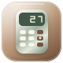

   

  

  
<b><em>macOS polish, Windows familiarity, and Linux freedom — in one fluid web OS.</em></b>

   

  

    

  

    

  

    <b>
      <a href="#interface-overview">Interface</a>
      &nbsp;&bull;&nbsp;
      <a href="#built-in-applications">Applications</a>
      &nbsp;&bull;&nbsp;
      <a href="#core-capabilities">Capabilities</a>
      &nbsp;&bull;&nbsp;
      <a href="#author">Author</a>
    </b>
  

   

  

 

---

## Overview

> *"Technology should leave you room to breathe."*

Soul OS reimagines desktop computing for the browser — combining native window management with zero-install accessibility.

- **Tactile**: Continuous proximity dock magnification, spring physics, and edge snapping.
- **Private**: 100% client-side. Zero tracking, zero telemetry, local persistence.
- **Unified**: macOS aesthetic craft, Windows workflow familiarity, and Linux autonomy.

 

---

## Interface Overview

| Desktop Environment | Entrance & Lock Screen |
|:---:|:---:|
|  |  |
| *Top system bar, weather widget, and magnetic dock.* | *Atmospheric entrance surface with session initialization.* |

| Multitasking & Window Stacking | System Settings & Personalization |
|:---:|:---:|
|  |  |
| *Edge snapping, z-stacking, and active dock scaling.* | *Appearance themes, sound controls, and developer notes.* |

 

---

## Built-in Applications

| Icon | Application | Purpose | Highlights |
|:---:|:---|:---|:---|
|  | **My PC (Files)** | Virtual filesystem | Breadcrumb pathing, search, grid/list view, trash recovery, and local file import. |
|  | **Notes** | Minimalist editor | Multi-note indexing, instant local auto-save, and live word counting. |
|  | **Gallery** | Image curator | Variable zoom (50%–300%), carousel navigation, and one-click wallpaper setting. |
|  | **Video** | Media player | Zero-upload local video playback with automatic memory cleanup. |
|  | **Calculator** | Desktop math utility | Precision arithmetic, percentage evaluation, and full keyboard entry. |
|  | **Browser** | Web portal | Smart address detection, search engine fallback, and external launch tabs. |
|  | **Settings** | Control hub | Visual themes, wallpaper gallery, dock scaling, audio volume, and preferences. |

 

---

## Core Capabilities

- **Magnetic Proximity Dock**: Smooth mathematical scale curve calculated across neighboring icons with launch bounce physics.
- **Window Management**: Boundary-constrained dragging, dynamic z-index focus stacking, and 3-way split/maximize snapping.
- **Workspaces**: 3 isolated virtual spaces with on-the-fly window reassignment.
- **Spotlight Search**: Global <kbd>Ctrl</kbd> / <kbd>Cmd</kbd> + <kbd>K</kbd> palette indexing apps, files, and system settings.
- **Control Center**: Grouped toggles for Wi-Fi, Bluetooth, Focus Mode, brightness, master volume, and battery telemetry.
- **Acoustic Feedback**: Centralized Web Audio service providing discrete cues for window events, clicks, and errors.
- **Curated Themes**: 8 bespoke photographic sceneries with light/dark adaptive balance.

 

---

## Deployment & Live Preview

> [!NOTE]
> The source codebase and build pipelines for **Soul OS** are maintained in a **private repository** for portfolio showcase.
>
> The fully compiled, interactive desktop application is deployed live at:  
> **[https://akshat96af.github.io/SoulOS/](https://akshat96af.github.io/SoulOS/)**

 

---

## Author

<table style="border: none;">
  <tr>
    <td width="90" align="center" valign="middle">
      
    </td>
    <td>
      <h3>Akshat</h3>
      
<em>UI Developer &bull; Creator of Soul OS</em>

      

        <a href="https://github.com/akshat96af">GitHub</a>
        &nbsp;&bull;&nbsp;
        <a href="https://instagram.com/_.a.k.s.h.a.t._">Instagram</a>
        &nbsp;&bull;&nbsp;
        <a href="#">LinkedIn</a>
      

    </td>
  </tr>
</table>

 

---

  
<b>Room to think. Space to be.</b>

  
Designed and developed by <a href="https://github.com/akshat96af">Akshat</a> &bull; Soul OS Edition 01

